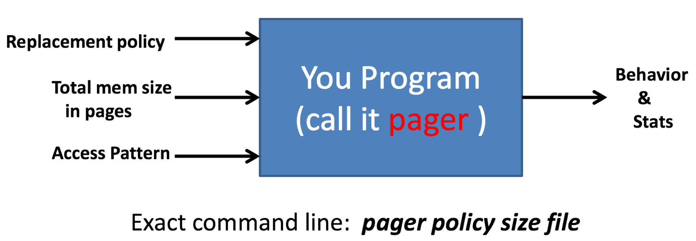

# CSCI-UA-201: Computer Systems Organisation, Project 2: Cache Optimisation
By Jason Yao

## Description
This programme's purpose is to simulate several page replacement policies, 
and compare among them to identify the "best" page replacement policy
in terms of performance.



Date: Spring, 2015

Location: New York University

Professor: Dr. Mohamed Zahran

Language(s): C (On another note, if ever chatting with Dr.Zahran, ask him about his feelings on Java)

## Executing steps
### Compilation
```sh
gcc -g pager.c -o pager
```

### Execution
```sh
./pager <policy> <size> <input_file>
```
Where:

- `policy` refers to which page replacement policy is to be simulated
	- `0` == First In, First Out (FIFO)
	- `1` == Least Recently Used (LRU)
	- `2` == Own (custom replacement policy)

- `size` refers to the total number of pages that can exist in memory at the same time, 
such that `size` is a non-zero positive number.

- `input_file` refers to a set of test files that can be piped into the programme,
in which it contains a list of pages being referenced.

E.g. Simulating `FIFO` with a maximum page capacity of `5` on a test case inside the file `testing/test10.txt`
```sh
./pager 0 5 testing/test10.txt
```

## Project Outcomes
- Learned about replacement policies

- Learned about page-hits & page-misses

- Implemented own replacement policy

## License
This repo is licensed under the GNU GPL v3, a copy of which may be found [here](LICENSE)
